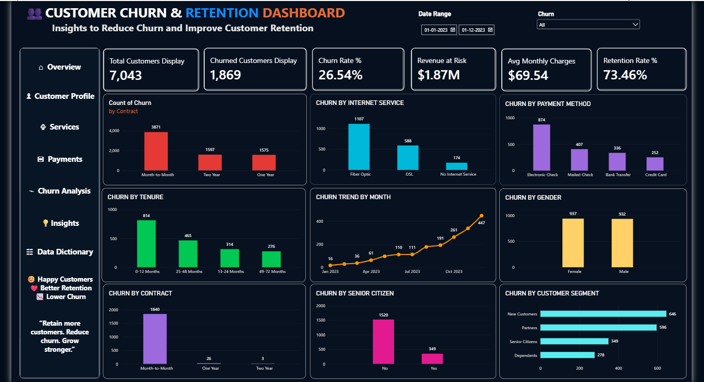

# 📊 Customer Churn & Retention Intelligence Dashboard | Power BI

## 🚀 Project Overview

Customer churn is one of the biggest challenges for subscription-based businesses.

This Power BI project analyzes customer churn and retention patterns to identify high-risk customer segments, major churn drivers, revenue at risk, and opportunities to improve customer retention.

The dashboard transforms raw customer data into actionable business insights that can help organizations reduce churn, improve retention, and protect recurring revenue.

---

## 🎯 Business Objective

The main objective of this project is to answer:

> **Why are customers leaving, which customers are most at risk, and where should the business focus its retention efforts?**

---

## 📌 Key KPIs

| KPI | Value |
|---|---:|
| 👥 Total Customers | **7,043** |
| ❌ Churned Customers | **1,869** |
| 📉 Churn Rate | **26.54%** |
| 🔄 Retention Rate | **73.46%** |
| 💰 Revenue at Risk | **$1.87M** |
| 💵 Avg. Monthly Charges | **$69.54** |

---

## 📊 Dashboard Analysis

The dashboard provides interactive analysis across:

- Contract Type
- Internet Service
- Payment Method
- Customer Tenure
- Gender
- Senior Citizen Status
- Customer Segment
- Monthly Churn Trend
- Churn Status
- Date Range

---

## 🔎 Key Business Insights

### 1. Contract Risk
Month-to-month customers show significantly higher churn compared with customers on longer-term contracts.

### 2. Customer Tenure
Customers with shorter tenure represent an important retention opportunity and should be targeted with early-stage engagement strategies.

### 3. Service Impact
Different internet service categories show different churn patterns, highlighting opportunities to improve service experience.

### 4. Payment Behavior
Churn varies across payment methods, making payment experience an important factor to monitor.

### 5. Revenue Impact
With approximately **$1.87M in revenue at risk**, reducing churn can directly contribute to protecting recurring revenue.

---

## 💡 Recommended Business Actions

Based on the analysis, businesses can:

- 🎯 Target high-risk month-to-month customers with retention offers.
- 🤝 Improve onboarding for newly acquired customers.
- 💰 Encourage customers to move toward longer-term contracts.
- 📞 Proactively engage customers showing early churn signals.
- 🛠️ Investigate service-related issues among high-churn segments.
- 📊 Monitor monthly churn trends to detect churn spikes early.

---

## 🛠️ Tools & Technologies

- **Power BI** – Dashboard & Data Visualization
- **DAX** – KPI & Business Metrics
- **Power Query** – Data Cleaning & Transformation
- **Microsoft Excel** – Raw Data Source
- **GitHub** – Project Documentation & Version Control

---

## 📂 Project Files

| File | Description |
|---|---|
| `Customer_Churn_Retention_Intelligence_Dashboard.pbix` | Power BI Dashboard |
| `Customer_Churn_Retention_Raw_Data.xlsx` | Raw Customer Dataset |
| `Dashboard_Preview.png` | Dashboard Preview |
| `README.md` | Project Documentation |

---

## 🔗 Project Links

### 💻 GitHub
[View My GitHub Profile](https://github.com/RAHULRAIGAR)

### 💼 LinkedIn
[Connect with me on LinkedIn](https://www.linkedin.com/in/rahul-raigar-data3293/)

### 📥 Raw Data
[Download Raw Dataset](YOUR_RAW_DATA_LINK)

---

## 📈 Dashboard Preview



---

## 📊 Business Value

This dashboard goes beyond simply displaying numbers.

It helps decision-makers:

✅ Identify high-risk customer groups  
✅ Understand major churn drivers  
✅ Prioritize retention strategies  
✅ Estimate potential revenue loss  
✅ Monitor churn trends  
✅ Improve customer retention  
✅ Protect recurring revenue  

---

## 📈 Analytical Approach

```text
Raw Customer Data
        ↓
Data Cleaning & Transformation
        ↓
Data Modeling
        ↓
DAX Measures & KPIs
        ↓
Churn Analysis
        ↓
Customer Segmentation
        ↓
Revenue Risk Analysis
        ↓
Interactive Power BI Dashboard
        ↓
Business Recommendations
---
🎯 Project Goal

The goal of this project is to demonstrate how customer data can be transformed into decision-ready business insights.

Data → Insights → Business Impact → Action
---
```
👨‍💻 Author
Rahul Raigar

Data Analytics | Power BI | SQL | Excel

🔗 GitHub:
https://github.com/RAHULRAIGAR

🔗 LinkedIn:
https://www.linkedin.com/in/rahul-raigar-data3293/
⭐ If you found this project useful, consider giving the repository a star!
